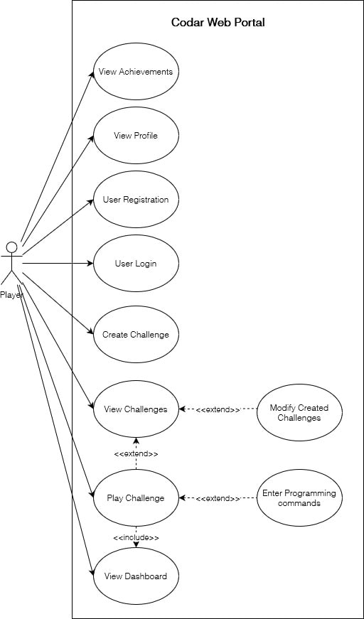
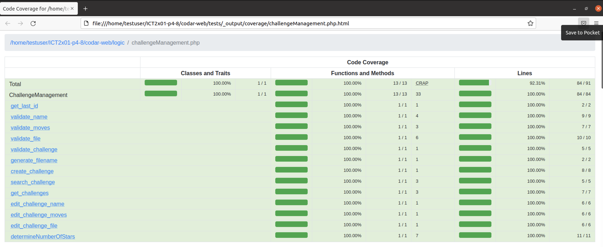
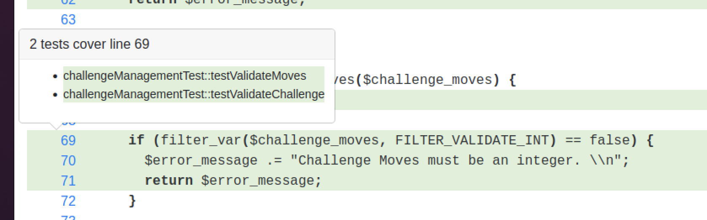
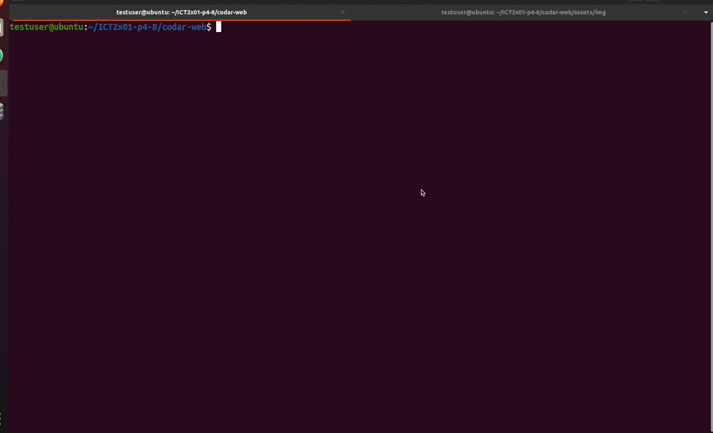

[](#)

# ICT2x01 Introduction to Software Engineering

## Members (Team P4-8)
- Kareem Mohamed Ashiq (Leader)
- Gerald Peh
- Poey Jin Rong, Jerome
- Lee Hui Shan
- Quek Chek Wee

## Repository Structure
The team has organised the working directory to mirror the chosen layered software architecture design pattern. With the user facing files in `presentation`, control and class management in `logic`, and database files in `database`.

```
.
├── README.md
├── codar-web
│   ├── assets
│   │   ├── css
│   │   ├── fonts
│   │   ├── img
│   │   │   ├── challenges
│   │   │   ├── curved-images
│   │   │   ├── dashboard
│   │   │   ├── error1.png
│   │   │   ├── favicon.png
│   │   │   ├── game_over.jpeg
│   │   │   ├── logo-ct.png
│   │   │   └── small-logos
│   │   ├── js
│   │   │   ├── blockly
│   │   │   │   ├── index.js
│   │   │   │   └── javascript_compressed.js
│   │   │   ├── core
│   │   │   ├── plugins
│   │   ├── node_modules
│   │   ├── package-lock.json
│   │   ├── package.json
│   │   └── scss
│   ├── constants.php
│   ├── databases
│   │   ├── codar-db.sqlite
│   │   ├── codar_infomations.db
│   │   └── database.php
│   ├── gulpfile.js
│   ├── index.php
│   ├── logic
│   │   ├── achievementManagement.php
│   │   ├── challengeManagement.php
│   │   ├── classes
│   │   │   ├── achievement.php
│   │   │   ├── challenge.php
│   │   │   └── user.php
│   │   ├── create_challenge_form.php
│   │   ├── create_user_form.php
│   │   ├── edit_challenge_form.php
│   │   ├── login_user_form.php
│   │   ├── userManagement.php
│   │   └── utility.php
│   ├── presentation
│   │   ├── achievements.php
│   │   ├── allAchievements.php
│   │   ├── challenges.php
│   │   ├── create_challenge.php
│   │   ├── dashboard.php
│   │   ├── edit_challenge.php
│   │   ├── game_over.php
│   │   ├── leaderboard.php
│   │   ├── linegraph.php
│   │   ├── modal.php
│   │   ├── play_challenge.php
│   │   ├── profile.php
│   │   ├── shared_presentation
│   │   │   ├── blockly.php
│   │   │   ├── footer.php
│   │   │   ├── head.php
│   │   │   ├── navbar.php
│   │   │   └── sidepanel.php
│   │   ├── sign-out.php
│   │   └── sign-up.php
│   └── tests
│       ├── _output
│       │   └── coverage
│       └── _support
└── readme_assets
    ├── codeception_demo.gif
    ├── html-coverage-lines.png
    ├── html-coverage.png
    └── html-testcase-coverage.gif
```

## Software Versions
1. PHP 7.4 (You can use other versions of PHP at your own risk. However, testing and development was done on 7.4)
2. SQLite3 v3.32.3
3. Codeception PHP Testing Framework v4.1.22 (For whitebox testing)

## Prerequisites
Between Windows or Mac/Linux OS, PHP is required to run Codar along with the SQLite3 extension. The following are guides on the installation of software for the respective OS.

### Mac/Linux OS
1. Install PHP v7.3/7.4  
[Linux guide to install php v7.3](https://askubuntu.com/questions/1231381/unable-to-install-php-7-3-on-ubuntu-20-04)  
`sudo apt install php7.4`
2. Install SQLite3 extension for PHP  
[Linux guide to install and enable sqlite3 extension](https://stackoverflow.com/questions/948899/how-to-enable-sqlite3-for-php)  
`sudo apt install php7-sqlite`

### Windows OS
1. Install PHP  
[Install PHP from official PHP downloads page](https://www.php.net/downloads)  
2. For convenience, configure php.exe as system environment variable   
[Configure php.exe as part of OS environment variable](https://stackoverflow.com/questions/2736528/how-to-set-the-env-variable-for-php)
3. Enable SQLite3 for php.exe   
[Windows guide to enable sqlite3 extension](https://roytuts.com/configure-php-7-and-sqlite3-in-windows/)  

### How To Run Codar
1. Change your working directory to ICT2x01-p4-8/codar-web/  
`cd ../ICT2x01/codar-web`
2. Execute command to host application on localhost, in this case port 8000 is used  
`php -S localhost:8000`
3. Open any browser and enter the url:  
`localhost:8000/index.php`

## Development Workflow
_As of **Mon 15 Nov 2021**_  
_Updated: **Sat 4 Dev 2021**_  
_Updated: **Mon 6 Dev 2021**_  

### Branches
1. **main** [`protected`] - The master/main branch, merges to this branch will indicate a production-ready application.
2. **development** [`protected`] - The pre-production stage of the application.
3. **features/x** - Branches that are created for housing development of **x** feature.  
For example (features/x):  
[features/login_system] - Branch containing development for login system  
[features/create_challenges] - Branch containing development for creating challenges
[features/view_achievements] - Branch containing development for the achievements page

4. **bugfixes/x** - Branches that are created for housing the fixing of bugs  
For example (bugfix/x):  
[bugfixes/login_system] - Branch containing the fix for a bug in login system
[bugfixes/view_profile] - Branch containing the fix for a visual bug in profile page

5. **whiteboxtest/x** -- Branch containing code for whitebox testing
For example (whiteboxtest/x):
[whiteboxtest/codeception] - Branch containing codes and resources for the usage of codeception test framework

### Workflow Commandments
1. Nobody shall commit to `main` except the owner and can only be merged from `development`
2. Direct updates to `development` branch can be made under the following conditions:
    - the changes you are planning to make do not require another branch (minor updates, perfective maintenance)
    - you are absolutely certain that your changes does not disrupt any member's development progress
    - you agree to hold all responsibility in the event of a disruption
3. Any branch that is ready for merging with `development` must have a working application with the feature fully developed  
3. Pull requests shall be approved by any collaborator, and only to the `development` branch for staging
4. Commits shall be named meaningfully to provide clear understanding including a comprehensive description

### Creating A New Feature/Fix Branch
#### 1. Determine Meaningful Branch Name
Ensure that the name of the branch correctly identifies the feature that you are planning to develop/bugfix.

#### 2. Create The Branch
If you are planning to add a new feature/bugfix, create the branch off the **development** branch. Unless the development of the new feature requires certain aspects of in-development branches.   
*please seek team approval before doing so.

Example for branching off development branch:  
`git branch -b features/x development` or create a new branch through the Github website.

#### 3. Merging Of Feature/Fix Branch
When you have finalised your code and are ready to merge the branch (feature/bugfix) into the `development` branch, create a new "Pull Request" and select the merging from new branch to `development` branch. Any collaborator is able to review and approve.

#### 4. Deletion Of Branch
Once the pull request is approved, you would usually delete the branch to avoid cluttering of branches in the repository. However, in this case, we will keep them for logging purposes.  
\*any lost of data or progress by deletion of branch will not be held liable by the owner or collaborators of the repository. The sole user who deleted the branch will be held responsibly.   


### UAT
#### 1. Embedded Youtube Video
Here is an embedded video that runs through all the test cases the team has created and refined from the Milestone 2 submission.  

[](https://youtu.be/F2rMhGwOggw)

#### 2. Detailed Information of System Test Cases
Here is an embedded PDF document detailing all the system test cases the team has created and refined from the Milestone 2 submission.
[ICT2x01_Milestone3_Report_UAT_System_Test_Cases_LabGroup(4)-(Team8)_AY2122.pdf](readme_assets/readme_assets/ICT2x01_Milestone3_Report:UAT_System_Test_Cases_Document:LabGroup4-Team8_AY2122.pdf)

#### 3. Use Case Diagram


The Use Case Diagram has been updated.

* Removed UC6 Modify Profile
* Removed UC11 Enter Programming Commands

### Whitebox Testing
The class that we have chosen to perform our whitebox test suite is the ChallengeManagement class. The team felt that this class would be the most meaningful as the core idea of the project (Gamification) majorly depends on this class.

The classes it interacts with are as follows:
- AchievementManagement Class `[codar-web/logic/achievementManagement.php]`
- Challenge Class `[codar-web/logic/classes/achievement.php]`

The framework we have chosen is the [Codeception Framework](https://codeception.com/) v4.1.22 which uses [PHPUnit](https://phpunit.de/) v8.5.20. Additionally, we have also enabled the [code coverage](https://codeception.com/docs/11-Codecoverage) feature for test statistics. The coverage we have chosen is the statement coverage which is performed by [PCOV](https://github.com/krakjoe/pcov). A custom test suite has been written to perform unit testing on the ChallengeManagement class.

#### File/Directory Structure and information
`codar-web/codeception.yml` contains information on the test configuration.  
`codar-web/test_assets/` contains resources that are used purely for testing.  
`codar-web/tests/unit/challengeManagementTest.php` is where the test suite is located.  
`codar-web/tests/_output/coverage/challengeManagement.php.html` contains a HTML report of the test suite.  
`codar-web/tests/_output/coverage/dashboard.html` contains the information on the test suite.

#### How to install Codeception
[Codeception Quickstart Guide](https://codeception.com/quickstart)

1. Download codeception  
`wget https://codeception.com/codecept.phar`
2. Install codeception using phar  
`php codecept.phar`
3. Since codeception requires php curl and mbstring extension as well,  
[Guide on installing php curl extension](https://stackoverflow.com/questions/33775897/how-do-i-install-the-ext-curl-extension-with-php-7)  
`sudo apt-get install php7.4-curl`   
[Guide on installing php mbstring extension](https://askubuntu.com/questions/491629/how-to-install-php-mbstring-extension-in-ubuntu)  
`sudo apt-get install php7.4-mbstring`  
4. Install pcov for [codeception code coverage](https://codeception.com/docs/11-Codecoverage)  
[Guide on installing pcov](https://github.com/krakjoe/pcov/blob/develop/INSTALL.md)  
`sudo apt install php-pcov`


#### How to run Codeception
1. Ensure you are in the `whiteboxtest/codeception` branch
2. Change your working directory to ICT2x01-p4-8/codar-web/  
`cd ICT2x01-p4-8/codar-web`
3. Execute the following command  
`./codecept.phar run unit --coverage --coverage-html`  
\* if you encounter insufficient permission issues, you might consider using `sudo`.

#### Test Cases
The challengeManagementTest file can be located at `codar-web/tests/unit/challengeManagementTest.php`. The test cases are as follows:
- `testRetrieveChallenge()`
- `testGetLastId()`
- `testValidateName()`
- `testValidateMoves()`
- `testValidateFile()`
- `testValidateChallenge()`
- `testGenerateFile()`
- `testCreateChallenge()`
- `testSearchChallenge()`
- `testGetChallenge()`
- `testEditChallengeName()`
- `testEditChallengeMoves()`
- `testEditChallengeFile()`
- `testDetermineNumberOfStars()`

#### Test Suite Code Coverage Statistics
The statement coverage statistic was generated using [Codeception](https://codeception.com/) and the [PCOV](https://github.com/krakjoe/pcov) extension. The full HTML report coverage can be found in `codar-web/tests/_output/coverage/challengeManagement.php.html` or view an online version (links below). Additionally, the report dashboard contains information such as the overall and function-specific cyclomatic complexity, line coverage of each function and the classes, and showcases which tests cover the corresponding lines.

You can also view the report online with the following links:
- [ChallengeManagement Test Report](https://htmlpreview.github.io/?https://github.com/hellogeraldblah/ICT2x01-p4-8/blob/whiteboxtest/codeception/codar-web/tests/_output/coverage/challengeManagement.php.html)
- [Report Dashboard](https://htmlpreview.github.io/?https://raw.githubusercontent.com/hellogeraldblah/ICT2x01-p4-8/whiteboxtest/codeception/codar-web/tests/_output/coverage/dashboard.html).


  




#### Codeception Unit Test Demonstration

